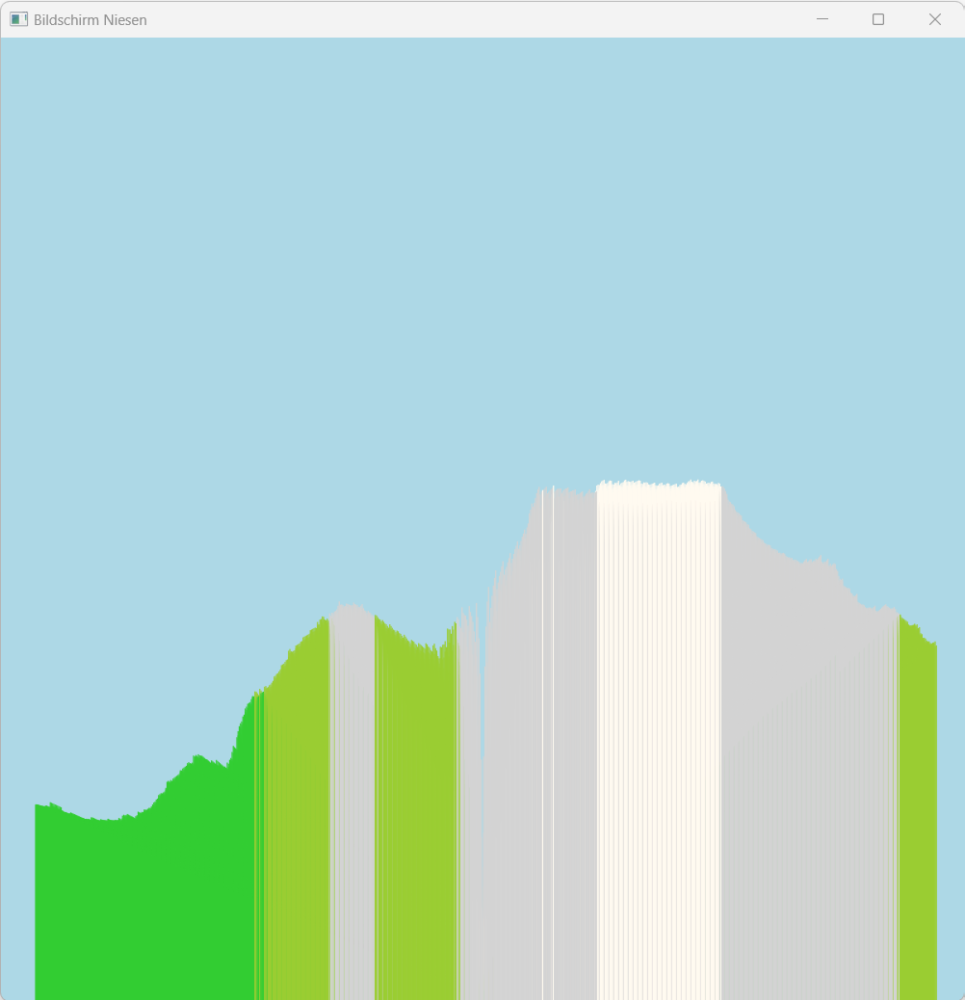
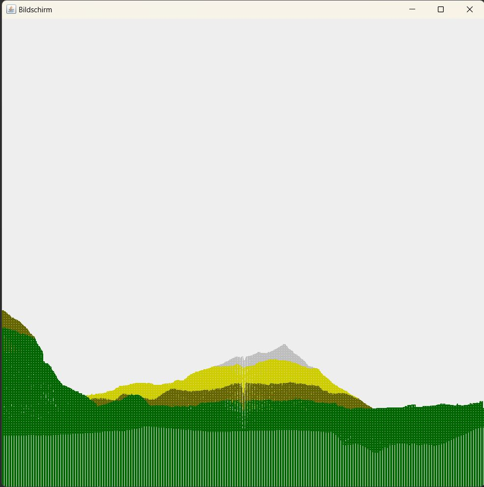

# Maturarbeit 2018 Silvan Spiess

## Description
This Project consists of four part.
- Drawing a box in JavaFX
- Drawing a simple TriangleMesh in JavaFX
- Drawing a mountain with TriangleMeshes in JavaFX
- Implementing a Raycaster for said mountain

Steps 3 and 4 received a Glow-Up version in 2024, since they have not been working as expected.

## How to run it:
1. Make sure, Java 11 or higher is installed
2. Make sure, Maven is installed
3. Clone this repository
4. Run the follinging command in the projects root dir:
    >mvn javafx:run
5. Select your preferred options in the commandwindow

## Remarks:
- The Data has been compressed by a python script (see in \[res\])
- You can choose between the folling two moutnains: **Niesen** / **Gantrisch**, do that in the CLI, when it asks you to choose.
- The non-Glow-Up versions of TerrainMesh and RayCaster don't work, as Github does not allow 1.2GB of data in a repository.
- The Raycaster's original version works better, than the Glow-Up version, however data is unprocessed and takes a few minutes to render.

## Result of the TerrainMesh Glow-Up version for the Niesen
https://github.com/SilvanSpiess/Maturarbeit-2018/assets/38469156/09302e17-b3b3-4b76-8233-7cf814f0776e

 ## Results of the RayCaster for the Niesen (Left Glow-Up / Right Original)

